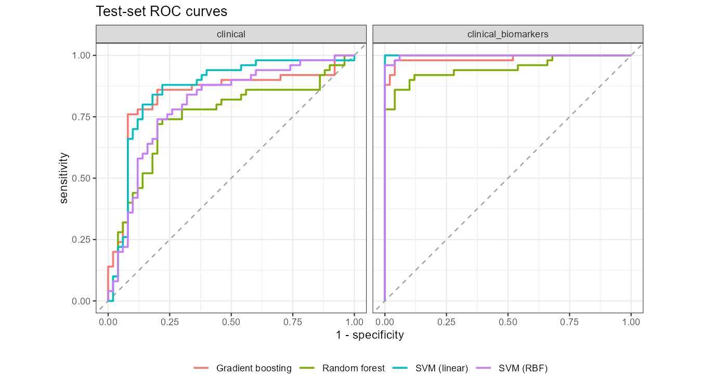
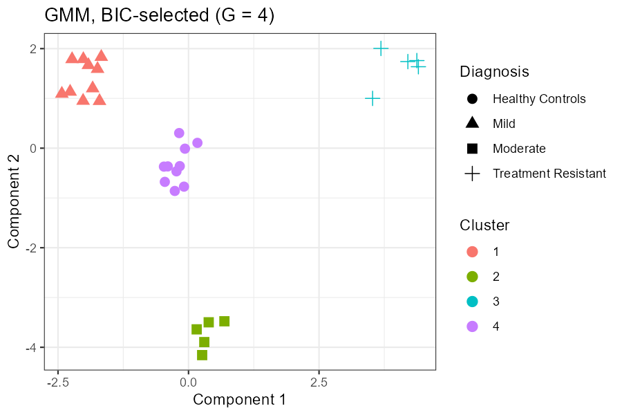
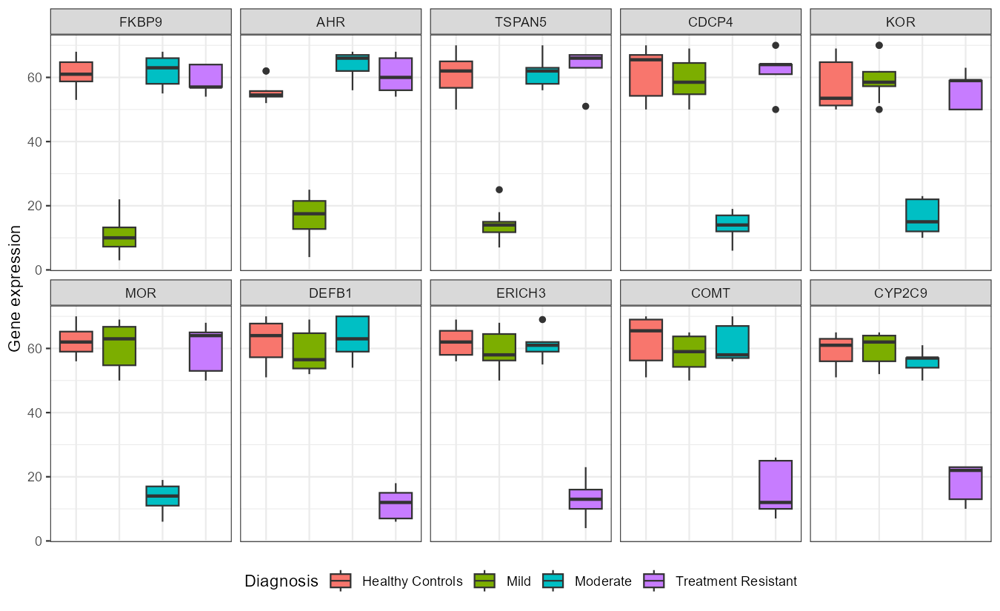
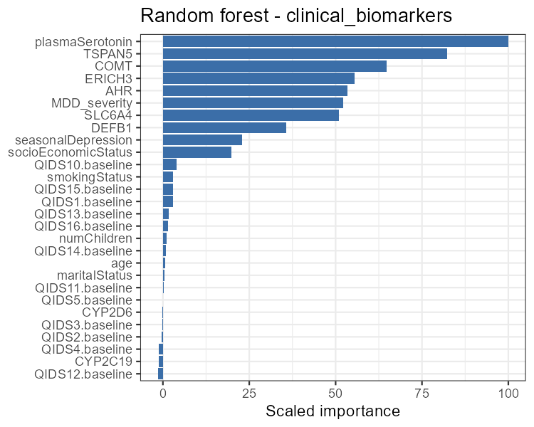
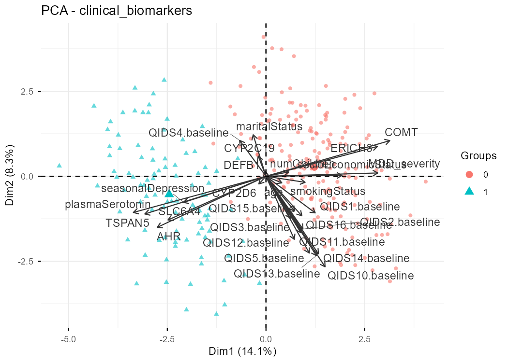

# Machine learning in clinical pharmacology

**[→ Interactive results dashboard](https://wrlog.github.io/ml-clinical-pharmacology/)**

Three R analyses that apply unsupervised and supervised machine learning to pharmacology questions in
major depressive disorder (MDD):

| # | Question | Methods | Headline result |
|---|---|---|---|
| 1 | Do clusters of gene-expression profiles recover the clinical diagnosis? | PCA, k-means, hierarchical clustering, Gaussian mixture models | 6 of 10 clusterings reproduce the 4 diagnostic groups exactly (ARI = 1) |
| 2 | Do clinical factors predict SSRI remission, and do biomarkers add to them? | Random forest, linear & RBF SVM, gradient boosting (tidymodels) | Clinical factors alone reach test AUC 0.90; adding biomarkers lifts it to 1.00, but at the default 0.5 threshold several models miss most remitters |
| 3 | Same question with baseline symptom items and an external test cohort | Same four models | Biomarkers again give near-perfect ranking (AUC 1.00), but lower biomarker levels in the external cohort push many remitters below the threshold |

## Key findings

1. **Gene expression separates the diagnoses cleanly.** With four clusters, k-means, all three hierarchical linkages
   and a BIC-selected Gaussian mixture reproduce the four diagnostic groups exactly (adjusted Rand index = 1).
2. **Clinical factors predict remission better than chance.** Using sociodemographic factors and MDD severity alone,
   the linear SVM reaches test AUC 0.90 and accuracy 0.82, against a no-information rate of 0.50.
3. **Biomarkers improve ranking, not necessarily classification.** Adding plasma serotonin and pharmacogene levels
   pushes test AUC to 0.95–1.00 for every model. Yet at the default 0.5 probability threshold, the RBF SVM labels
   every patient as a non-remitter and gradient boosting finds only about a quarter of remitters.
4. **Probabilities don't transfer to the external cohort.** In analysis 3, every biomarker in the external test cohort
   is about 30% lower than in training, for remitters and non-remitters alike (for example, plasma serotonin in remitters
   averages 67.6 in training vs 49.8 in the test cohort). The models still order patients correctly, but their predicted
   probabilities shift downwards. Recalibrating or normalizing per site would be needed before using a fixed threshold.



## 1 · Unsupervised clustering of gene expression

30 subjects (20 with depression of varying severity, 10 healthy controls) × 10 genes. Clusterings are
scored against the diagnosis with the **adjusted Rand index** (ARI; 1 = perfect agreement, 0 = chance).

| Clustering | Clusters | ARI vs diagnosis |
|---|---:|---:|
| k-means, k = 4 | 4 | 1.00 |
| Hierarchical (complete), k = 4 | 4 | 1.00 |
| Hierarchical (single), k = 4 | 4 | 1.00 |
| Hierarchical (average), k = 4 | 4 | 1.00 |
| GMM, BIC-selected | 4 | 1.00 |
| GMM, G = 4 | 4 | 1.00 |
| k-means, k = 5 | 5 | 0.96 |
| GMM, G = 5 | 5 | 0.86 |
| k-means, k = 3 | 3 | 0.74 |
| GMM, G = 3 | 3 | 0.74 |

<p>
  
  
</p>

## 2 · Predicting SSRI remission

400 patients with MDD treated with an SSRI (random 300/100 train/test split). Each model is trained on
**clinical** features (6 sociodemographic variables + MDD severity) and on **clinical + biomarkers**
(plasma serotonin + 8 pharmacogenes).

| Features | Model | CV AUC | Test AUC | Accuracy | Sensitivity | Specificity | p (acc > NIR) |
|---|---|---:|---:|---:|---:|---:|---:|
| Clinical | Random forest | 0.91 ± 0.01 | 0.81 | 0.67 | 0.86 | 0.48 | <0.001 |
| Clinical | SVM (linear) | 0.91 ± 0.01 | 0.90 | 0.82 | 0.94 | 0.70 | <0.001 |
| Clinical | SVM (RBF) | 0.78 ± 0.01 | 0.82 | 0.80 | 0.84 | 0.76 | <0.001 |
| Clinical | Gradient boosting | 0.90 ± 0.01 | 0.86 | 0.68 | 0.88 | 0.48 | <0.001 |
| Clinical + biomarkers | Random forest | 1.00 ± 0.00 | 0.95 | 0.82 | 0.76 | 0.88 | <0.001 |
| Clinical + biomarkers | **SVM (linear)** | 1.00 ± 0.00 | **1.00** | 0.81 | 0.62 | 1.00 | <0.001 |
| Clinical + biomarkers | SVM (RBF) | 1.00 ± 0.00 | 1.00 | 0.50 | 0.00 | 1.00 | 0.540 |
| Clinical + biomarkers | Gradient boosting | 1.00 ± 0.00 | 0.99 | 0.62 | 0.24 | 1.00 | 0.010 |

No-information rate on the test set: 0.50. CV AUC is mean ± SE over 50 resamples.

## 3 · Adding baseline symptom items

The same design with 12 item-level QIDS-SR baseline symptoms added to the clinical feature set, a predefined
300-patient training cohort and a 100-patient external test cohort.

| Features | Model | CV AUC | Test AUC | Accuracy | Sensitivity | Specificity | p (acc > NIR) |
|---|---|---:|---:|---:|---:|---:|---:|
| Clinical + symptoms | Random forest | 0.91 ± 0.01 | 0.75 | 0.53 | 0.92 | 0.14 | 0.309 |
| Clinical + symptoms | SVM (linear) | 0.90 ± 0.01 | 0.86 | 0.72 | 0.94 | 0.50 | <0.001 |
| Clinical + symptoms | SVM (RBF) | 0.89 ± 0.01 | 0.80 | 0.50 | 0.00 | 1.00 | 0.540 |
| Clinical + symptoms | Gradient boosting | 0.90 ± 0.01 | 0.84 | 0.56 | 0.92 | 0.20 | 0.136 |
| + biomarkers | Random forest | 1.00 ± 0.00 | 0.95 | 0.82 | 0.64 | 1.00 | <0.001 |
| + biomarkers | **SVM (linear)** | 1.00 ± 0.00 | **1.00** | 0.76 | 0.52 | 1.00 | <0.001 |
| + biomarkers | SVM (RBF) | 1.00 ± 0.00 | 1.00 | 0.50 | 0.00 | 1.00 | 0.540 |
| + biomarkers | Gradient boosting | 1.00 ± 0.00 | 0.99 | 0.63 | 0.26 | 1.00 | 0.006 |

No-information rate on the test set: 0.50. CV AUC is mean ± SE over 50 resamples.

<p>
  
  
</p>

## Methods

- **Tuning:** 5× repeated, stratified 10-fold cross-validation on the training set; 5-point grid per model.
  Hyperparameters chosen by CV accuracy (analysis 2) or CV ROC AUC (analysis 3).
- **Evaluation:** each final model is scored once on the held-out test set. Remission (`response = 1`) is the
  positive class. Test accuracy is compared with the no-information rate (majority-class share) by a one-sided
  exact binomial test.
- **Variable importance:** permutation importance for random forest (ranger) and the SVMs (mean drop in accuracy over 10 permutations, vip),
  gain for gradient boosting (xgboost); all scaled to 0–100.

## Repository layout

```
analysis/                     one script per analysis
  01_unsupervised_gene_expression.R
  02_ssri_response_prediction.R
  03_ssri_response_with_symptoms.R
R/
  supervised_helpers.R        shared model specs, tuning, evaluation and export
  build_dashboard_data.R      bundles results/*.csv into dashboard/results.js
  install_packages.R
results/                      metrics, ROC curves, importance, PCA output (CSV) and figures (PNG)
index.html, dashboard/        static dashboard served by GitHub Pages
data/                         input CSVs go here (not included; see data/README.md)
```

## Reproduce

```bash
Rscript R/install_packages.R
# put the input CSVs in data/ (see data/README.md), then:
Rscript run_all.R
```

Open `index.html` in a browser to view the dashboard locally. The full pipeline takes roughly 10–15 minutes
on an 8-core laptop.

## Notes

- The datasets are **synthetic** teaching data provided in a graduate course on applied data science and AI in
  clinical pharmacology (MPET 6450). They are not redistributed here, and results should not be read as clinical findings.
- Results in `results/` were produced with R 4.5.2, tidymodels 1.x, ranger 0.18, kernlab 0.9.33 and xgboost 3.2.
  Exact numbers can shift slightly across package versions.
